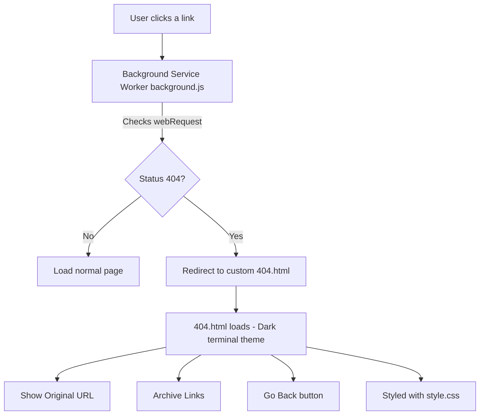

# 404-archive-redirect

> A Chromium extension that intercepts 404 errors and redirects to a custom page with  archive links.

> [!WARNING]
 This extension redirects 404 pages to archived versions. Archived pages may contain outdated, inaccurate, or insecure content. Use at your own risk.

**View 404 Page** https://icedmoca.github.io/404-archive-redirect/404.html

**View 404 Page If you have the extension installed** http://distrowatch.com/images/cgfjoewdlbc/blackarch.png

## Installation

1. Open Chromium/Chrome browser
2. Navigate to `chrome://extensions/`
3. Enable "Developer mode" (toggle in top right)
4. Click "Load unpacked"
5. Select the extension folder (`404-archive-redirect`)
6. The extension should now be loaded and active

## How It Works




## Features

- ✅ Intercepts all 404 errors automatically
- ✅ Modern hacker-terminal UI design
- ✅ Archive services table (Wayback Machine, Ghost Archive, UK Web Archive, etc.)
- ✅ Dynamic capture count indicator for Wayback Machine (+9 badge)
- ✅ Copy buttons for each archive service URL
- ✅ One-click URL copying to clipboard
- ✅ Responsive design for mobile/desktop
- ✅ Animated visual effects
- ✅ Original URL preservation and display

## Testing

To test the extension:

1. **Load the extension** in Chrome/Chromium:
   - Go to `chrome://extensions/`
   - Enable "Developer mode"
   - Click "Load unpacked" and select this folder

2. **Test with 404 pages**:
   - Visit `chrome-extension://[extension-id]/test.html` (use the test.html)
   - Or visit a non-existent URL (e.g., `https://example.com/nonexistent-page-12345`)
   - The extension should redirect to the custom 404 page

3. **Debug if needed**:
   - Open Developer Tools (F12)
   - Check the Console tab for debug messages
   - Look for messages like "404 detected for:" and "Redirecting to:"

4. **Test functionality**:
   - Use "Go Back" to return to the previous page (now works in one click!)
   - Click the copy button (📋) next to the URL to copy it to clipboard
   - Try the archive services in the table - click "View" to open or "📋" to copy the archive URL
   - Check that the original URL is displayed correctly

## Archive Services Included

The extension provides access to multiple archiving services:

| Service | Description | Actions |
|---------|-------------|---------|
| **Wayback Machine** | Internet Archive's comprehensive web archiving service | View / Copy URL |
| **Ghost Archive** | Social media content archiving | View / Copy URL |
| **UK Web Archive** | British Library national archive | View / Copy URL |
| **Library of Congress** | Search Library of Congress digital collections | View / Copy URL |
| **Common Crawl** | Search through raw archived web crawls | View / Copy URL |

Each service provides both a direct link (opens in new tab) and a copy button for the archive URL.

## Permissions Used

- `webRequest`: Detect HTTP status codes  
- `tabs`: Redirect current tab to 404.html  
- `storage`: Save user preferences (future features)  
- `<all_urls>`: Required to listen across all domains 

## Browser Compatibility

- Chromium/Chrome (Manifest V3)
- Edge (Chromium-based)
- Other Chromium-based browsers

## Files Structure

```
404-archive-redirect/
├── manifest.json      # Extension manifest (MV3)
├── background.js      # Service worker for intercepting 404s
├── 404.html          # Custom 404 page
├── script.js         # JavaScript for 404 page functionality
├── style.css         # Hacker-terminal inspired styling
├── test.html         # Test page for debugging
└── README.md         # This file
```


## Customization

You can modify:
- `style.css`: Change colors, fonts, animations
- `404.html`: Modify text content and layout
- `background.js`: Adjust interception logic
- `manifest.json`: Update permissions or metadata

## To-Do
- [ ] Custom Themes  
- [ ] Theme sync with current Chrome theme  
